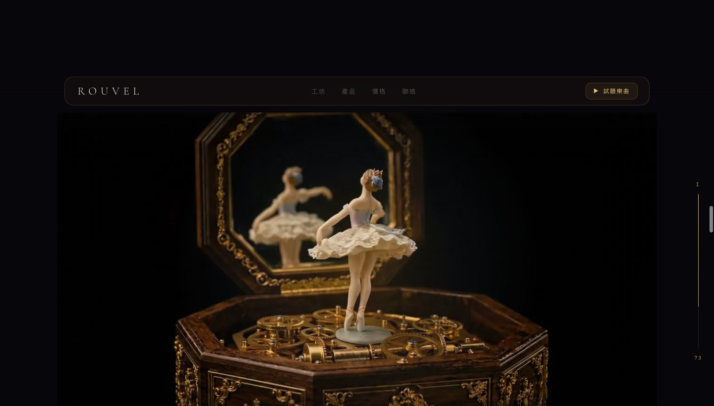

# Aurelia — 沉浸式產品展示網頁

[](https://claudecode-web-design.netlify.app/)
[](https://app.netlify.com/sites/claudecode-web-design/deploys)
[](https://claude.com/claude-code)

> 一具 19 世紀八角音樂盒「Aurelia」的沉浸式產品頁。隨著捲動,音樂盒從閤蓋、開蓋到瓷偶起舞逐格展開 —— Apple 產品頁式的 scroll-driven animation。

### 🔗 線上展示 Live Demo

**https://claudecode-web-design.netlify.app/**



> 隨捲動展開的逐幀動畫(實際捲動更滑順):
>
> 

---

## ✨ 特色

- **捲動驅動的逐幀動畫** — 192 張影片幀依捲動位置即時繪製於 `<canvas>`,呈現音樂盒開啟的完整過程。
- **商品融入背景** — 利用 `mix-blend-mode: screen`,讓純黑底的幀融進深色頁面,商品像實體般「浮」在虛空中,周圍伴隨會呼吸的金色光暈。
- **磨砂玻璃介面** — 導航列、價格卡、聯絡表單皆採半透明模糊(glassmorphism)、圓角網格化設計。
- **完整一頁式內容** — 工坊介紹、產品三段工藝、限量價格方案、聯絡表單。
- **可運作的聯絡表單** — 串接 [Netlify Forms](https://docs.netlify.com/forms/setup/),送出後資料自動進入後台。
- **背景樂曲試聽** — 「試聽樂曲」按鈕播放音樂盒的真實旋律(由原始影片抽出)。
- **捲動高亮導航、進場淡入、scroll-spy**,並尊重 `prefers-reduced-motion`、支援鍵盤焦點與 RWD。

## 🛠 技術

純靜態網站 —— 單一 [`index.html`](index.html),內嵌 CSS 與原生 JavaScript,**無框架、無建置流程、零相依套件**。

- HTML5 Canvas(逐幀 scrubbing)
- IntersectionObserver(scroll-reveal / scroll-spy)
- WebP 影像(192 幀,較原始 JPG 省約 48% 體積)
- Netlify(部署)+ Netlify Forms(表單)
- 字體:Cormorant Garamond / Inter / IBM Plex Mono

## 🚀 本地預覽

Canvas 需透過 HTTP 載入影像(不能直接用 `file://` 開啟):

```bash
python3 -m http.server 8765
# 開啟 http://localhost:8765
```

> 注意:聯絡表單的完整送出流程依賴 Netlify,**僅能在線上版本測試**;本地伺服器對 POST 會回 501。

## 📁 專案結構

```
index.html        # 整個網站(HTML + CSS + JS)
frames/           # 192 張 WebP 影格 frame_0001 ~ frame_0192
audio/aurelia.m4a # 音樂盒樂曲(由原始影片抽出)
wooden_music_video.mp4  # 來源影片
CLAUDE.md         # 給 AI 協作者的架構說明
```

## 🔄 重新產生素材

素材皆由 `wooden_music_video.mp4`(8 秒 / 24fps / 1280×720)產生,需要 `ffmpeg` 與 `cwebp`(`brew install webp`):

```bash
# 影格:JPG → WebP q80
ffmpeg -i wooden_music_video.mp4 -q:v 2 frames/frame_%04d.jpg
for f in frames/frame_*.jpg; do cwebp -q 80 "$f" -o "frames/${f%.jpg}.webp"; done

# 樂曲音軌
ffmpeg -i wooden_music_video.mp4 -vn -c:a copy audio/aurelia.m4a
```

> 若影格數量改變,記得同步更新 `index.html` 中的 `TOTAL` 常數。

---

*以 [Claude Code](https://claude.com/claude-code) 製作。Aurelia 與 Maison Rouvel 為展示用虛構品牌。*
